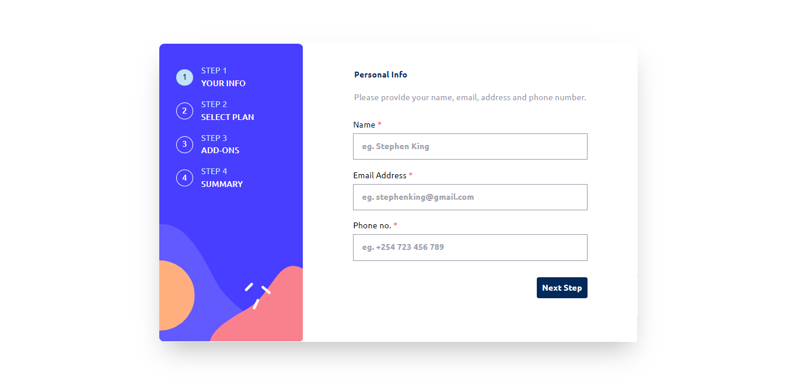

# Multi-step form

## Table of contents

- [The challenge](#the-challenge)
- [Screenshot](#screenshot)
- [Links](#links)
- [My process](#my-process)

  - [Built with](#built-with)

- [Author](#author)

### The challenge

Users should be able to:

- Complete each step of the sequence
- Go back to a previous step to update their selections
- See a summary of their selections on the final step and confirm their order
- View the optimal layout for the interface depending on their device's screen size
- See hover and focus states for all interactive elements on the page
- Receive form validation messages if:
  - A field has been missed
  - The email address is not formatted correctly
  - A step is submitted, but no selection has been made

### Screenshot

### Links

- Live Site URL: [Multistep-Form](https://newt-multistep-form.netlify.app/)

## My process

Hooks used (useState, useEffect, useRef, useContect)

### Built with

- Semantic HTML5 markup
- Mobile-first workflow
- [React](https://reactjs.org/) - JS library
- [Vite](https://nextjs.org/) - Faster Biulds
- [Tailwind CSS](https://styled-components.com/) - For styles

## Author

- Frontend Mentor - [@newton](https://www.frontendmentor.io/profile/newton-w)
- LinkedIn - [@newton](https://www.linkedin.com/in/newton-warui/)
